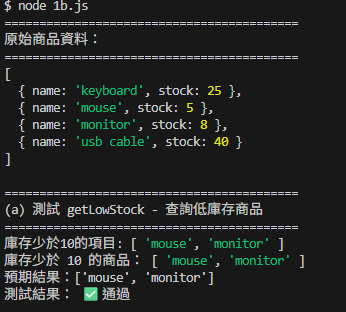
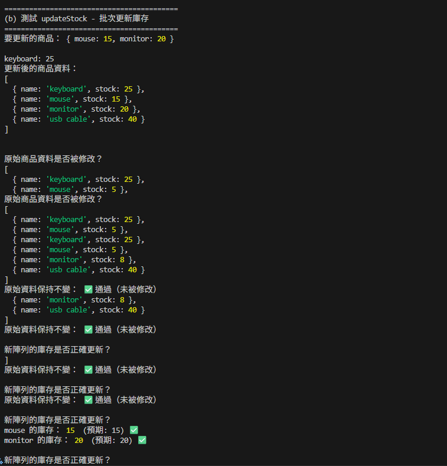
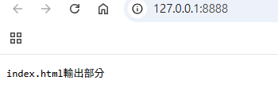
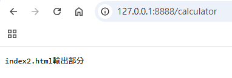
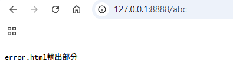
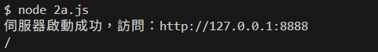
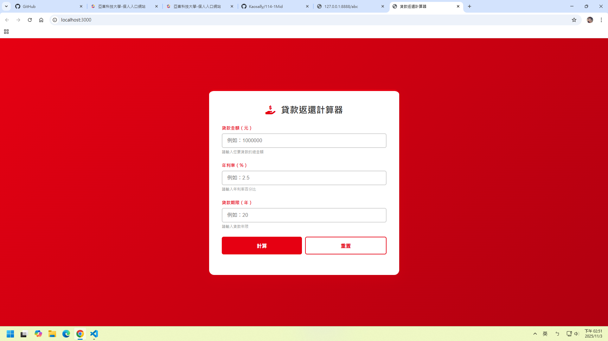

# 第2次隨堂題目-隨堂-QZ2
>
>學號：1234567   (學號和姓名都要寫)
><br />
>姓名：王小明
>

本份文件包含以下主題：(至少需下面兩項，若是有多者可以自行新增)
- [x] 說明內容

## 說明程式與內容

開始寫說明，該說明需說明想法，
並於之後再對上述想法的每一部分將程式進一步進行展現，
若需引用程式區則使用下面方法，
若為.cs檔內程式除了於敘述中需註明檔案名稱外，
還需使用語法` ```語言種類 程式碼 ``` `，其中語言種類若是要用python則使用py，java則使用java，C/C++則使用cpp，
下段程式碼為語言種類選擇csharp使用後結果：

```csharp
public void mt_getResult(){
    ...
}
```

若要於內文中標示部分網頁檔，則使用以下標籤` ```html 程式碼 ``` `，
下段程式碼則為使用後結果：

```html
<%@ Page Language="C#" AutoEventWireup="true" ...>

<!DOCTYPE html>

<html xmlns="http://www.w3.org/1999/xhtml">
<head runat="server">
<meta http-equiv="Content-Type" ...>
    <title></title>
</head>
<body>
    <form id="form1" runat="server">
        <div>
        </div>
    </form>
</body>
</html>
```
更多markdown方法可參閱[https://ithelp.ithome.com.tw/articles/10203758](https://ithelp.ithome.com.tw/articles/10203758)

請在撰寫"說明程式與內容"該塊內容，請把原該塊內上述敘述刪除，該塊上述內容只是用來指引該怎麼撰寫內容。

1. a.

Ans: 
(1)觀念:此庫存內容用到了陣列及物件
(2)解釋:陣列就像是一份藍圖,也就是設計圖的概念而物件就是透過這份藍圖做出來的真實內容(物件),若沒有藍圖則無法做出物件。


1. b.

Ans:

<!-- 請撰寫時，最後一句話再寫一次 -->
```js
[
  { name: "keyboard", stock: 25 },
  { name: "mouse", stock: 5 },
  { name: "monitor", stock: 8 },
  { name: "usb cable", stock: 40 }
];

function getLowStock(products) {
  const lowStockNames = []; //宣告一個空陣列用來存放庫存量少於10的商品名稱
  for(let i = 0; i< products.length; i++){ //使用for迴圈依序檢查每個產品的庫存量, 從i = 0開始一直到超過陣列長度為止
    if(products[i].stock < 10){
      lowStockNames.push(products[i].name);
    }
  }
  console.log("庫存少於10的項目:" , lowStockNames)
  return lowStockNames; // 回傳lowStockNames陣列給外部函式
}

getLowStock(products);
```


上方這段程式碼中的getLowStock函式會接收一個產品陣列,並依序檢查每個產品的庫存,此函式會將庫存量少於10的所有產品名稱收集起來並存到一個空陣列中,然後印出"庫存少於10的項目"字樣及對應的產品名稱,回傳陣列到函式外部。
回傳陣列到函式外部。

1. c.

Ans:

```js
function updateStock(products, updates) {
  const newProducts = []; // 用來存放更新過後的商品名稱
  for(let i = 0; i < products.length; i++){
    let item = products[i];
    
    newProducts.push({
      name: products[i].name,
      stock: updates[item.name] ?? item.stock //如果updates中有這個商品的新庫存則用新的,若沒有則庫存量不變
    });
  }
  //印出每個產品的庫存量(若有更新則印出更新後的庫存量)
  for(let i = 0; i < newProducts.length; i++){
    console.log(`${newProducts[i].name}: ${newProducts[i].stock}`);
    
  return newProducts; //回傳newProducts陣列給外部函式
  }
}

updateStock(products, updates);
```



上方這段程式碼中的函式是用來更新商品的庫存量,透過updateStock函式比對updates將需要更新的產品進行更新後回傳。首先利用遍歷舊資料products陣列 找出所有的商品並確認這項商品有無在需要更新的項目陣列updates中 若有則更新後加入newProducts陣列中;接著透過遍歷newProducts陣列印出 有被更動過的(新庫存)產品名稱及庫存量。
上方這段程式碼中的函式是用來更新商品的庫存量

<!--  請撰寫時，第一句話再寫一次  -->

2. a.

Ans:
```js
//1、引入http模組
const http = require('http');

//2、創建http伺服器
const server = http.createServer(function (request, response) {
  const url = request.url;  //獲取請求位址
  console.log(url)
  var answer = '';  //設置回應內容

  // 請寫 switch完成各個收到不同的請求以及輸出不同的回應字串 (使用 switch)
//以switch判斷不同的路徑(路由處理)
switch (url) {
  case '/':
    //當使用者請求根目錄時,輸出以下文字內容
    answer = 'index.html輸出部分';
    break;
  case '/calculator':
    //當使用者請求/calculator時,輸出以下文字內容
    answer = 'index2.html輸出部分';
    break;
  default:
    //其他任何未定義路徑則輸出以下文字內容
    answer = 'error.html輸出部分';
}
  response.setHeader('Content-Type', 'text/plain;charset=utf-8'); //設置回應頭編碼為utf-8，避免中文亂碼
  response.end(answer);
});
//3、啟動伺服器監聽8888埠
server.listen('8888', function () {
  console.log("伺服器啟動成功，訪問：http://127.0.0.1:8888")
})
```





上方這段程式碼是引入http模組後建立簡易伺服器,根據不同的路徑回傳不同的文字內容給用戶端且設定回應標頭 為純文字型態及UTF-8編碼 避免中文出現亂碼
監聽伺服器及成功連線時會印出"伺服器啟動成功，訪問：http://127.0.0.1:8888",進入連接後輸入上述說明的不同的路徑出現不同的結果 如圖1,2,3顯示
上方這段程式碼是引入http模組後建立簡易伺服器
<!--  請撰寫時，第一句話再寫一次  -->

2. b.

Ans:
```js
// http 模組：用於創建 HTTP 伺服器
const http = require('http');

// fs 模組 (File System)：用於讀取檔案系統中的文件
const fs = require('fs');

// ejs 模組：用於渲染 EJS 模板引擎，將動態內容嵌入 HTML
const ejs = require('ejs');

// path 模組：用於處理和解析文件路徑，提取副檔名
const path = require('path');

// ==========================================
// 創建並配置 HTTP 伺服器
// ==========================================

http.createServer((req, res) => {
  // req (request): 請求物件，包含客戶端發送的所有資訊（URL、標頭等）
  // res (response): 回應物件，用於向客戶端發送回應（HTML、狀態碼等）

  // ==========================================
  // 步驟 1: URL 路由與頁面分派
  // ==========================================

  // 宣告兩個變數來處理不同類型的請求：
  // filePath: 儲存要渲染的 EJS 模板文件路徑
  // fileOtherFile: 儲存靜態資源（CSS、JS 等）的路徑
  let filePath = '';
  let fileOtherFile = '';

  // Switch根據不同路由要寫的部分
//使用switch判斷不同的路徑，並設定對應的文件路徑
switch (req.url) {
  case '/':
    //當使用者請求首頁時,回傳index.ejs文件
    filePath = '/index.ejs';
    break;
  case '/calculator':
    //當使用者請求/calculator時,回傳index2.ejs文件
    filePath = '/index2.ejs';
    break;
  default:
    //其他未定義路徑則回傳index3.ejs文件(404頁面)
    filePath = '/index3.ejs';
    break;
})


//處理靜態資源請求的部分
if(req.url.endsWith('.css') || req.url.endsWith('.js') || req.url.endsWith('.png') || req.url.endsWith('.jpg') || req.url.endsWith('.gif') || req.url.endsWith('.svg') || req.url.endsWith('.ico')){
  fileOtherFile = req.url;
}
```


這段程式碼也是引入http模組並製作簡易伺服器,根據不同的路徑顯示不同的檔案。當路徑為「'/'」時顯示 「'index.ejs'」檔案內容;當路徑為「'/calculator'」時則顯示 「'index2.ejs'」檔案內容;最後,若請求的網址包含未定義路徑則顯示「'index3.ejs'」的檔案內容。
另外透過endsWith方法去尋找需要處理的靜態資源部分。
最重要的是需要在三個ejs檔案中更改連線css的路徑為 「/style.css」、「/style2.css」、「/style3.css」(因為若沒加上斜線實際上路徑為C:\Users\user\Desktop\114-1Mid
並未真正連到正確的路徑
)
這段程式碼也是引入http模組並製作簡易伺服器

<!--  請撰寫時，第一句話再寫一次  -->

2. c.

Ans:
```js
//取得錯誤頁面文件
const error404 = '/index3.ejs';

// 讀取404頁面文件
fs.readFile('error404', 'utf8', (err, date) => {
  res.writeHead(404, { 'Content-Type': 'text/html; charset=utf-8' }); //設定回應頭，狀態碼為404，內容類型為HTML，編碼為utf-8
  res.end(date); //將讀取到的404頁面內容發送給客戶端
})
```


當伺服器接收到的網址不包含「'/'」及「'/calculator'」時則回傳錯誤頁面內容,且需要在ejs檔案中更改連線css的路徑為「/style3.css」。(因為若沒加上斜線實際上路徑為C:\Users\user\Desktop\114-1Mid
並未真正連到正確的路徑)
當伺服器接收到的網址不包含「'/'」及「'/calculator'」時則回傳錯誤頁面內容
且需要在ejs檔案中更改連線css的路徑為「/style3.css」。(因為若沒加上斜線實際上路徑為C:\Users\user\Desktop\114-1Mid
並未真正連到正確的路徑)
<!--  請撰寫時，第一句話和最後一句再寫一次  -->

2. d.

Ans:


